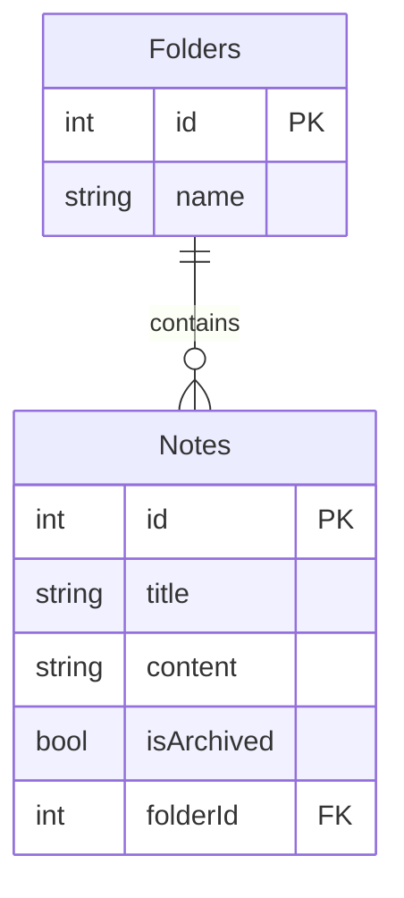

# NotatApp

This is the backend solution for NotatAppFrontend repository. It exposes API endpoints which get and write from/to SQLite database.

## Architecture

This is Restfull API build in ASP.NET Core with 2 main api routes:
/api/notes
/api/folders

Notes have following properties: id, title, content, isArchived, folderId (foreign key).
Folders have following properties: id, name. Default names are "Work", "Personal", "Ideas", "Done"

One Folder can have many notes. One to many relationship between folders table and notes table in SQL.

## Documentation

Swagger: http://localhost:5001/swagger/index.html
